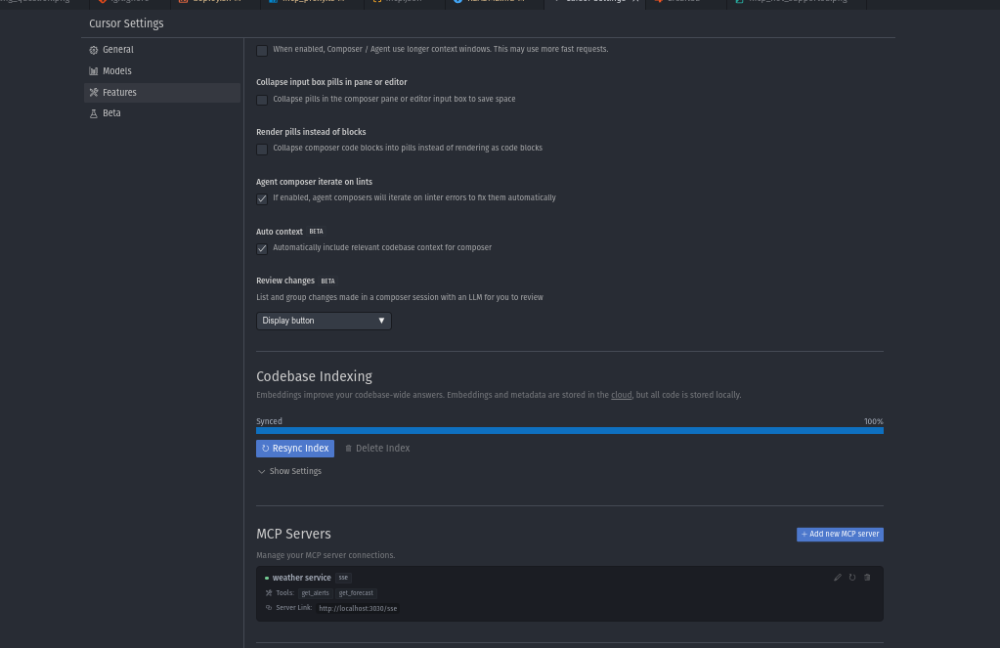

# Host MCP SSE Server on Google Cloud Run

At the momenet (03/04/2024) MCP is still addressing Authentication and Authorization. They plan to complete this in H1 2025. The issue is, I want to share my MCP server with my team NOW. So here we are.

Utilizing GCP Cloud Run and User Based IAM Authentication, I have created a simple, secure way to allow clients to access a custom MCP server over the internet.

[MCP Roadmap](https://modelcontextprotocol.io/development/roadmap)


## How it works

The MCP server is hosted on Google Cloud Run. Utilizing Cloud Run IAM Authentication, we can securely connect to the server from the internet by utilizing the Google Cloud SDK to create a proxy connection.

# TLDR README

This ***should work out of the box*** with minimal config if you already have docker and the gcloud CLI set up locally.

**Step 1:** Update `deploy.sh` with your project id, service account email, etc. 

**Step 2:** On deploy success, grab the cloud run URL that was provided, and add it to `mcp_proxy.ts` along with your project id.

**Step 3:** Run the proxy `npx ts-node mcp_proxy.ts`


# LONG BORING README
## Deployment Steps

1. Clone the repository
2. Run `npm install` to install the dependencies
3. Run `npm run dev` to start the server locally

## Deployment to Google Cloud Run

To deploy your MCP server to Google Cloud Run:

1. Make sure you have the [Google Cloud SDK](https://cloud.google.com/sdk/docs/install) installed
2. Update the `deploy.sh` script with your project details:
   - `PROJECT_ID`: Your Google Cloud project ID
   - `REGION`: Your preferred GCP region
   - `SERVICE_ACCOUNT_EMAIL`: The service account email with appropriate permissions
3. Run the deployment script:
   ```
   chmod +x deploy.sh
   ./deploy.sh
   ```

The deployment script will:

- Build a Docker container for your MCP server
- Push it to Google Container Registry
- Deploy it to Cloud Run with authentication enabled

## Connecting to your deployed MCP server

To connect to your deployed MCP server:

1. Run the MCP proxy locally:

   ```bash
   npx ts-node mcp_proxy.ts
   ```

2. The proxy will:

   - Check if you're authenticated with Google Cloud
   - Obtain authentication tokens automatically
   - Create a local proxy server (default: http://localhost:3030)
   - Forward authenticated requests to your Cloud Run service

3. Configure your MCP client to connect to the local proxy URL

## Use the MCP server in Cursor

1. First, let's run our proxy to establish a connection between our local machine and the MCP server hosted on Google Cloud Run.

```
npx ts-node mcp_proxy.ts
```

2. Now let's add our local proxy server to cursor within the Setting > Features tab in the MCP server section.




3. Now, we're good to go! Start a new composer (ensure you are in agent mode) and ask what the weather is in a location. Your ouput in your terminal where the proxy is connected + the output of your composer should look like this:


## Security

This setup provides several security benefits:

- Your MCP server is not publicly accessible without authentication
- All connections are secured with Google Cloud IAM
- Team members need Google Cloud SDK access to connect

### Connection Issues

- Verify the Cloud Run URL in `mcp_proxy.ts` matches your deployed service
- Check Cloud Run logs for any server-side errors

## Contributing

Contributions are welcome! Feel free to submit issues or pull requests.

## License

[MIT](LICENSE)
